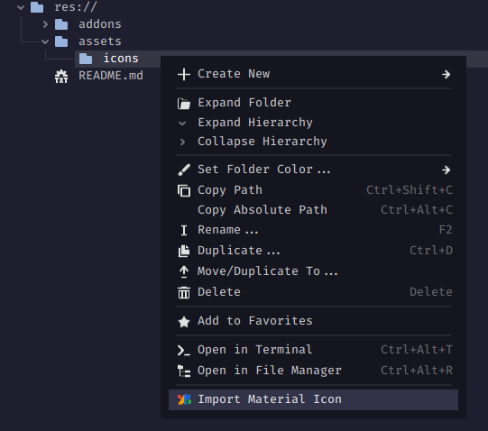

# Material Icons Importer
Lets you view & import textures from Google's Material Icons library by right clicking a folder in the FileSystem dock.

## Features
- View every icon in the Google Material Icons library, neatly separated into categories.
- Quickly switch between Filled, Outlined, Sharp, Round, and Two-tone icons.
- Saves all imported icons locally, leaving no dependency to the plugin or internet.

